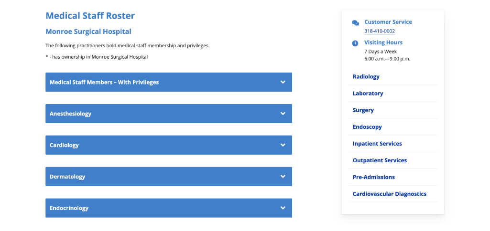

A hospital physician directory that only let you browse by specialty. If you didn't already know your doctor's specialty, you were stuck opening every accordion, hunting name by name — there was no search at all.

I hit that wall myself while doing routine data cleanup, which is how I found the problem the stakeholders had stopped seeing. They assumed browsing by specialty was simply how medical directories worked.

So I built dual-mode search: toggle between searching by specialty or by provider name, with results filtering in real time as you type. Searching by name auto-expands the matching specialty groups, so a provider always appears inside their context instead of floating loose.

<!-- Single line on purpose: a multi-line <video> open tag is not a valid CommonMark HTML block (video is absent from the block-tag list), so the parser escapes it. -->
<video src="/media/provider-search-demo.mp4" poster="/media/provider-search-poster.jpg" width="1352" height="600" muted loop playsinline controls preload="metadata" data-autoplay aria-label="Demo of the rebuilt directory: Filter by Specialty and Filter by Name toggle buttons above a search input. As a name is typed, results filter in real time and the matching specialty groups expand automatically."></video>

The specialty grouping existed for a reason — some people really do search that way. The fix wasn't to tear it down; it was to add the search mode the interface was missing.

> build: vanilla JavaScript, real-time DOM filtering across a large provider dataset
